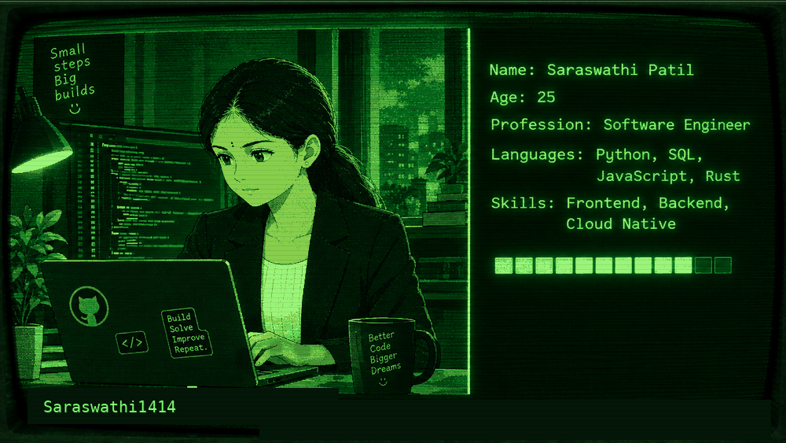

## `$ whoami`

> Computer Science & Engineering Graduate → Code is how I learn; building is how I understand

`build • learn • experiment • improve`  

## `$ ls projects`

### [Pomegranate Disease Prediction →](YOUR_GITHUB_REPO_LINK)
`CNN • Deep Learning • Image Classification • Web App`

`Problem` → Timely and accurate detection of pomegranate fruit diseases.

`Approach` → Hybrid CNN–LSTM model with image preprocessing and deep feature extraction.

`Pipeline` → Dataset → Preprocessing → Model Training → Image Upload → Disease Prediction

## 🔗 🌐 Connect With Me

  
  
  

